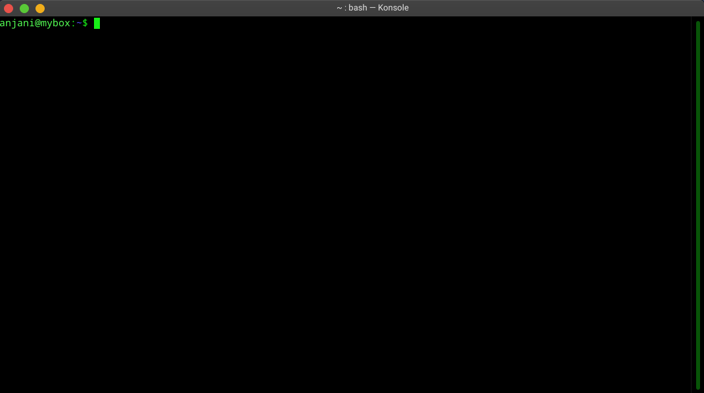

# suto - sudo touch

suto is a Linux PAM authenticator which uses Android phone biometrics to verify user credentials for granting super-user
access.



This repository is hosting the desktop module to be called by Linux PAM for authentication written in C++. 
Networking is done by **Boost.Asio** library.

### How does it work?

This module makes _UDP_ broadcasts. The clients can reply back by opening a _TCP_ channel
with it and exchange messages according our defined protocol. After auth, this module returns
__PAM_SUCCESS__ or __PAM_AUTH_ERROR__ depending upon the result of authentication. For detailed 
info on our protocol see [PROTOCOL.md](PROTOCOL.md)

### Dependencies

* _Boost C++ v1.42.0_ or later
* _Cmake v3.16_ or later

### Installation

```sh
git clone https://github.com/anjanik012/suto.git
cd suto
mkdir build
cmake -B build/
cd build
make
sudo cp libsuto_pam.so /usr/lib/security
```

After placing the module in the right place for Linux to call, we need to tell
PAM applications to call our module before the system default module.

Applications save this setting to `/etc/pam.d`

Choose whichever application you want to auth with suto and open their config file

I'm choosing `su`.

Add a line 

`auth sufficient libsuto_pam.so`

Now whenever you run `su` our PAM module will be called for authentication.

To test this we have a python script in [tests/](/tests)

### TO-DO

* Clear unnecessary logging
* Create a standalone executable which calls the module
* Android module is Work-in-Progress


<!-- ### Work done

* **Device detection over _UDP_** - This desktop module broadcasts _UDP_ packets with _SUTO_UDP_HELLO_ message on receiver
port _2020_ and listens for _TCP_ connection on sender port _2021_ asynchronously. 

* **TCP connection established with detected device**- The device upon receiving the broadcast message attempts to connect
with the desktop over _TCP_ and succeeds.

* **Authentication Protocol works** - The implementation of protocol in file `PROTOCOL.md` works. 

* **Sample test**- A test is written in python which mimics the behaviour of actual android client yet to be written. -->